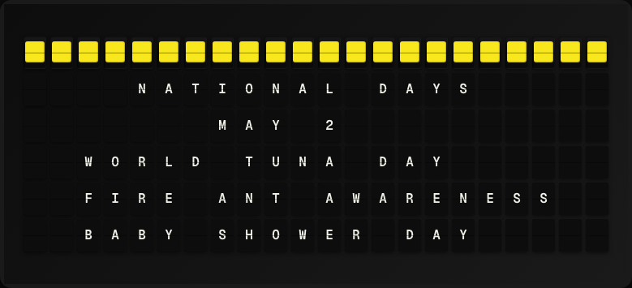

# National Day Plugin

Display today's national days and fun observances from a bundled dataset.



**→ [Setup Guide](./docs/SETUP.md)**

## Overview

The National Day plugin ships with a bundled dataset of popular national days and fun observances organized by month and day. No external API or network connection is required. The dataset covers hundreds of observances.

## Template Variables

| Variable | Description | Example |
|---|---|---|
| `national_day.holiday` | Name of the national day / observance | `National Coffee Day` |
| `national_day.date` | Today's date | `September 29` |
| `national_day.count` | Total number of observances today | `3` |

## Example Templates

```
NATIONAL DAY
{{national_day.date}}

{{national_day.holiday}}

+{{national_day.count}} more today
```

## Configuration

| Setting | Name | Description | Required |
|---|---|---|---|
| `holiday_index` | Holiday Position | Which holiday to show when there are multiple (1 = first). | No |

## Features

- Bundled dataset — no network required
- Hundreds of national days and fun observances
- Multiple observances per day
- Holiday position selection

## Author

FiestaBoard Team
